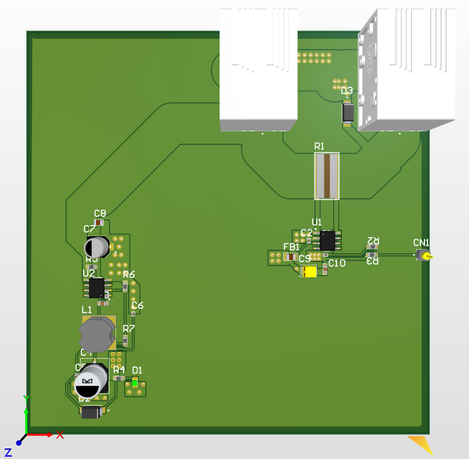
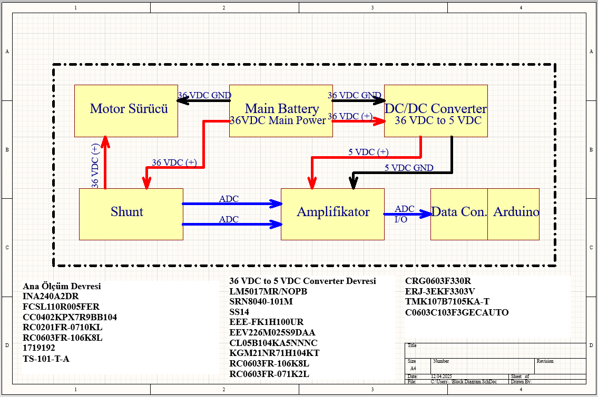
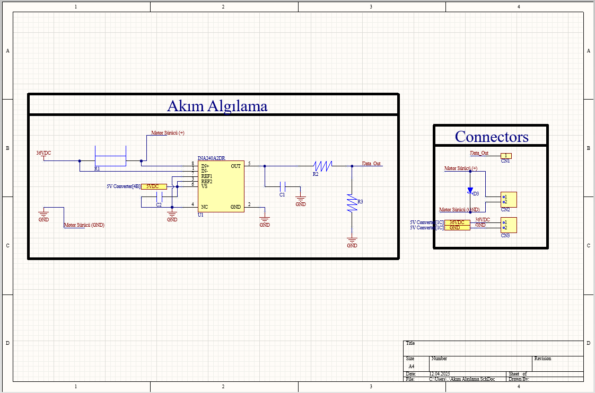
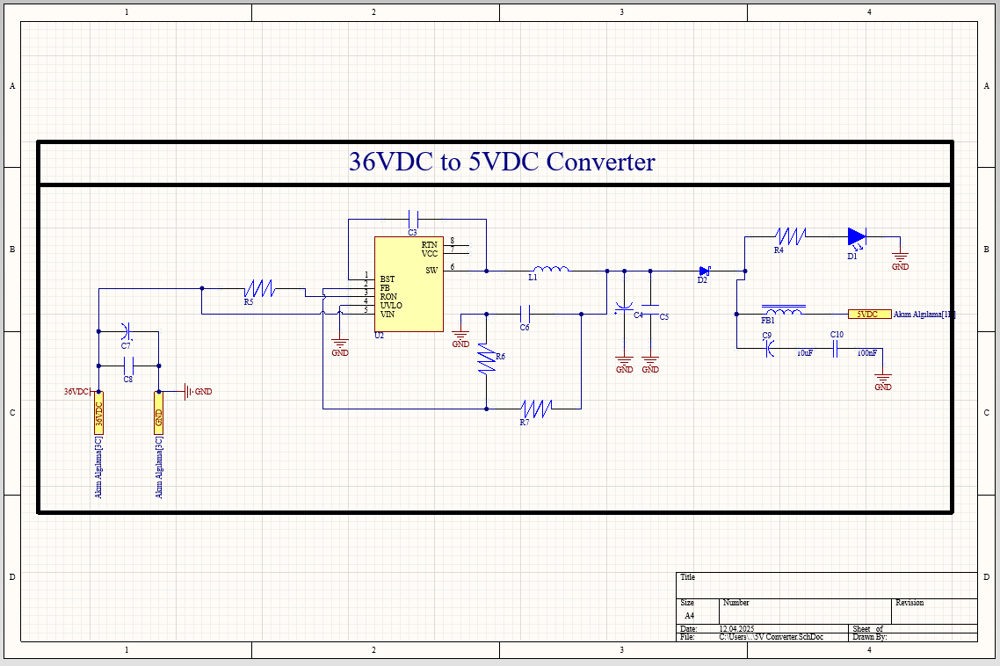

# INA240 High-Side Current Sensing & Power Module

This repository contains the hardware design files (Altium Designer) for a custom current sensing module designed for 36V DC systems. It features a high-side current measurement circuit using the **INA240** amplifier and an integrated **LM5017** DC-DC buck converter to power low-voltage logic circuits.

## 📖 Project Overview

This module was designed to monitor the current consumption of DC motors in a robotic system (e.g., UAV or Mobile Robot). It acts as an interface between the high-voltage power source (36V Main Battery) and the control logic (STM32/Arduino).

### Key Features
* **High-Side Current Sensing:** Uses the TI INA240A2 (Gain: 50V/V) for precise measurement with excellent PWM rejection.
* **Integrated Power Supply:** Onboard LM5017 Buck Converter steps down 36V input to 5V (1A max) to power the sensor and external microcontrollers.
* **Compact Design:** 2-layer PCB designed for ease of integration.

## ⚙️ Technical Specifications

| Feature | Description |
| :--- | :--- |
| **Input Voltage** | 36V DC Nominal |
| **Sensing Method** | High-Side Shunt Measurement |
| **Current Amplifier** | INA240A2DR |
| **Shunt Resistor** | 5mΩ (FCSL110R005FER) |
| **DC/DC Converter** | LM5017 (Iso-Buck capable, configured as Buck) |
| **Output Voltage** | 5V DC (for logic) |
| **Signal Output** | Analog Voltage (ADC Compatible) |

## 🔌 Block Diagram & Schematics

The system connects between the main battery and the motor driver. The sensed current is amplified and sent to the MCU's ADC pin.

### Current Sensing Stage
The INA240 is configured to measure the voltage drop across the shunt resistor placed on the 36V line.

### Power Management Stage
The 36V input is regulated down to 5V to ensure the sensor and connected MCU operate without an external power source.

## ⚠️ Design Notes & Disclaimer

**Educational Project:**
This PCB was designed as part of an early engineering learning process to practice **Altium Designer** and **Power Electronics** concepts.

* **Layout Considerations:** While the circuit is functional, future iterations would benefit from optimized loop areas in the Buck Converter section for better EMI performance.
* **Thermal Management:** For continuous high-current applications, thermal vias under the shunt resistor could be increased.

Feel free to use this design as a reference for your own learning journey!

## 🛠️ Bill of Materials (Key Components)

* **U1:** INA240A2DR (Current Sense Amp)
* **U2:** LM5017MR/NOPB (Buck Regulator)
* **R1 (Shunt):** FCSL110R005FER (5mΩ)
* **L1:** SRN8040-101M (100uH Inductor)
* **D2:** SS14 (Schottky Diode)

## 📄 License

This project is open-source and available under the [MIT License](LICENSE).
